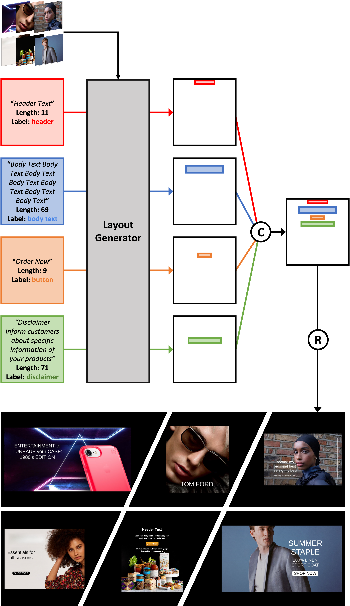

# LayoutDETR

### [LayoutDETR: Detection Transformer Is a Good Multimodal Layout Designer](https://arxiv.org/pdf/2212.09877.pdf)
[Ning Yu](https://ningyu1991.github.io/), [Chia-Chih Chen](https://scholar.google.com/citations?user=0Hr1SOUAAAAJ&hl=en), [Zeyuan Chen](https://www.linkedin.com/in/zeyuan-chen-0253b6141/), [Rui Meng](http://memray.me/), [Gang Wu](https://www.linkedin.com/in/whoisgang/), [Paul Josel](https://www.linkedin.com/in/paul-josel/), [Juan Carlos Niebles](http://www.niebles.net/), [Caiming Xiong](http://cmxiong.com/), [Ran Xu](https://www.linkedin.com/in/ran-x-a2765924/)<br>
arXiv 2023

### [paper](https://arxiv.org/pdf/2212.09877.pdf) | [project page]() | [demo video]()

<pre>	</pre>
</pre>

## Abstract
Graphic layout designs play an essential role in visual communication. Yet handcrafting layout designs is skill-demanding, time-consuming, and non-scalable to batch production. Generative models emerge to make design automation scalable but it remains non-trivial to produce designs that comply with designers' multimodal desires, i.e., constrained by background images and driven by foreground content. We propose *LayoutDETR* that inherits the high quality and realism from generative modeling, while reformulating content-aware requirements as a detection problem: we learn to detect in a background image the reasonable locations, scales, and spatial relations for multimodal foreground elements in a layout. Our solution sets a new state-of-the-art performance for layout generation on public benchmarks and on our newly-curated ad banner dataset. We integrate our solution into a graphical system that facilitates user studies, and show that users prefer our designs over baselines by significant margins.

## Prerequisites
- Linux
- NVIDIA GPU + CUDA 11.3
- To install conda virtual environment, run
	```
	conda env create -f environment.yaml
	conda activate layoutdetr
	```
- Download [Up-DETR pretrained weights](https://drive.google.com/file/d/1JhL1uwNJCaxMrIUx7UzQ3CMCHqmZpCnn/view?usp=sharing) to `pretrained/`.
- To build Chrome-based text rendering environment, run
	```
	apt-get update
	cp chromedriver /usr/bin/chromedriver
	ln -fs /usr/share/zoneinfo/America/Los_Angelos /etc/localtime
	DEBIAN_FRONTEND=noninteractive apt --assume-yes install ./google-chrome-stable_current_amd64.deb
	```

### Data preprocessing
[Our ad banner dataset](https://storage.cloud.google.com/sfr-layoutdetr-data-research/data/ads_banner_collection_manual_3x_mask.zip) (9.9GB, 7,672 samples). Part of the source images are filtered from [Pitt Image Ads Dataset](https://people.cs.pitt.edu/~kovashka/ads/readme_images.txt) and the others are crawled from Google image search engine with retailer brands as keywords. Download our prepared dataset to `data/ads_banner_collection_manual_3x_mask` which contains two subdirectories:
- `manual_json_png_gt_label` subdirectory contains a set of `*.png` files representing well-designed images with foreground elements superimposed on the background. It also correspondingly contains a set of `*.json` files with the same file names as of `*.png`, representing the layout ground truth of foreground elements of each well-designed image. Each `*.json` file contains a set of bounding box annotations in the form of `[cy, cx, height, width]`, their label annotations, and their text contents if any.
- `manual_LaMa_3x_stringOnly_inpainted_background_images` subdirectory correspondingly contains a set of `*.png` files representing the background-only images of the well-designed images. The subregions that were superimposed by foreground elements have been inpainted by the [LaMa technique](https://github.com/saic-mdal/lama). There are 2x extra random subregions also inpainted, which aim at avoiding generator being overfitted to inpainted subregions if we inpaint only ground truth layouts. The augmented inpainting subregions serve as false postive which are inpainted but are not ground truth layouts.
- To preprocess the dataset that are efficient for training, run
	```
	python dataset_tool.py \
	--source=/export/share/ning/projects/webpage_generation/stylegan3_detr_genRec_uncondDis_gIoU_fixedTextEncoder_shallowTextDecoder_unifiedNoise_textNoImageCond_backgroundCond_paddingImageInput_CNN_overlapping_alignment_losses_D_LM_D_visualDecoder/data/dataset/ads_banner_collection_manual_3x_mask/raw/manual_json_png_gt_label \
	--dest=/export/share/ning/projects/webpage_generation/stylegan3_detr_genRec_uncondDis_gIoU_fixedTextEncoder_shallowTextDecoder_unifiedNoise_textNoImageCond_backgroundCond_paddingImageInput_CNN_overlapping_alignment_losses_D_LM_D_visualDecoder/data/dataset/temp/zip_ads_banner_collection_manual_3x_mask
	```
	where
	- `--source` indicates the source data path where you downloaded the raw dataset.
	- `--dest` indicates the preprocessed data path containing two files: `train.zip` and `val.zip` which are 9:1 splitted from the source data.

### Training
```
python train.py --gpus=8 --batch=16 --workers=8 --tick=1 --snap=100 \
--cfg=layoutganpp --aug=noaug \
--gamma=0.0 --pl-weight=0.0 \
--bbox-cls-weight=50.0 --bbox-rec-weight=500.0 --text-rec-weight=0.1 --text-len-rec-weight=2.0 --im-rec-weight=0.5 \
--bbox-giou-weight=4.0 --overlapping-weight=7.0 --alignment-weight=17.0 --z-rec-weight=5.0 \
--z-dim=4 --g-f-dim=256 --g-num-heads=4 --g-num-layers=8 --d-f-dim=256 --d-num-heads=4 --d-num-layers=8 \
--bert-f-dim=768 --bert-num-heads=4 --bert-num-encoder-layers=12 --bert-num-decoder-layers=2 \
--background-size=256 --im-f-dim=512 \
--metrics=layout_fid50k_train,layout_fid50k_val,fid50k_train,fid50k_val,overlap50k_alignment50k_layoutwise_iou50k_layoutwise_docsim50k_train,overlap50k_alignment50k_layoutwise_iou50k_layoutwise_docsim50k_val \
--data=/export/share/ning/projects/webpage_generation/stylegan3_detr_genRec_uncondDis_gIoU_fixedTextEncoder_shallowTextDecoder_unifiedNoise_textNoImageCond_backgroundCond_paddingImageInput_CNN_overlapping_alignment_losses_D_LM_D_visualDecoder/data/dataset/ads_banner_collection_manual_3x_mask/zip/train.zip \
--outdir=/export/share/ning/projects/webpage_generation/stylegan3_detr_genRec_uncondDis_gIoU_fixedTextEncoder_shallowTextDecoder_unifiedNoise_textNoImageCond_backgroundCond_paddingImageInput_CNN_overlapping_alignment_losses_D_LM_D_visualDecoder/training-runs/layoutganpp/temp
```
where
- `--batch` indicates the total batch size on all the GPUs.
- `--data` indicates the preprocessed training data path.
- `--outdir` indicates the output path of model checkpoints, result snapshots, config record file, log file, etc.
- `--metrics` indicates the evaluation metrics measured for each model checkpoint during training, which can include layout FID, image FID, overlap penalty, misalignment penalty, layout-wise IoU, and layout-wise DocSim, etc. See more metric options in `metrics/`.
- See the definitions and default settings of the other arguments in `train.py`.

### Evaluation
Download the well-trained LayoutDETR model on our ad banner dataset from [here](https://storage.cloud.google.com/sfr-layoutdetr-data-research/models/layoutdetr_ad_banner.pkl) (2.7GB).
```
python evaluate.py --gpus=8 --batch=16 --workers=8 --tick=1 --snap=100 \
--cfg=layoutganpp --aug=noaug \
--z-dim=4 --g-f-dim=256 --g-num-heads=4 --g-num-layers=8 --d-f-dim=256 --d-num-heads=4 --d-num-layers=8 \
--bert-f-dim=768 --bert-num-heads=4 --bert-num-encoder-layers=12 --bert-num-decoder-layers=2 \
--background-size=256 --im-f-dim=512 \
--metrics=layout_fid50k_val,fid50k_val,overlap50k_alignment50k_layoutwise_iou50k_layoutwise_docsim50k_val,rendering_val \
--data=/export/share/ning/projects/webpage_generation/stylegan3_detr_genRec_uncondDis_gIoU_fixedTextEncoder_shallowTextDecoder_unifiedNoise_textNoImageCond_backgroundCond_paddingImageInput_CNN_overlapping_alignment_losses_D_LM_D_visualDecoder/data/dataset/ads_banner_collection_manual_3x_mask/zip/val.zip \
--outdir=/export/share/ning/projects/webpage_generation/stylegan3_detr_genRec_uncondDis_gIoU_fixedTextEncoder_shallowTextDecoder_unifiedNoise_textNoImageCond_backgroundCond_paddingImageInput_CNN_overlapping_alignment_losses_D_LM_D_visualDecoder/training-runs/layoutganpp/temp \
--resume=/export/share/ning/projects/webpage_generation/stylegan3_detr_genRec_uncondDis_gIoU_fixedTextEncoder_shallowTextDecoder_unifiedNoise_textNoImageCond_backgroundCond_paddingImageInput_CNN_overlapping_alignment_losses_D_LM_D_visualDecoder/training-runs/layoutganpp/ads_banner_collection_manual_3x_mask_50cls_2len_5z/00001-layoutganpp-ads_banner_collection_manual_3x_mask-gpus8-batch8-pl0.000-gamma0.000-overlapping7-alignment17/network-snapshot-007800.pkl
```
where
- `--resume` indicates the path of the well-trained generator .pkl file.
- `--metrics=rendering_val` indicates to render texts on background images given generated layouts.

### Layout generation in the wild
```
python generate.py --seeds=0-2 \
--network=/export/share/ning/projects/webpage_generation/stylegan3_detr_genRec_uncondDis_gIoU_fixedTextEncoder_shallowTextDecoder_unifiedNoise_textNoImageCond_backgroundCond_paddingImageInput_CNN_overlapping_alignment_losses_D_LM_D_visualDecoder/training-runs/layoutganpp/ads_banner_collection_manual_3x_mask_50cls_2len_5z/00001-layoutganpp-ads_banner_collection_manual_3x_mask-gpus8-batch8-pl0.000-gamma0.000-overlapping7-alignment17/network-snapshot-007800.pkl \
--bg='/export/share/ning/projects/datasets/from_Abigail/Lumber 1 [header]EVERYTHING 10% OFF[body text]Friends & Family Savings Event[button]SHOP NOW[disclaimer]CODE FRIEND10.jpg' \
--bg-preprocessing=256 \
--strings='EVERYTHING 10% OFF|Friends & Family Savings Event|SHOP NOW|CODE FRIEND10' \
--string-labels='header|body text|button|disclaimer / footnote' \
--outfile=temp/temp \
--out-postprocessing=horizontal_center_aligned
```
where
- `--seeds=XX-YY` indicates using different random seeds from range(XX, YY) to generate layouts.
- `--network` indicates the path of the well-trained generator .pkl file.
- `--bg` indicates the path of the provided background image file.
- `--bg-preprocessing` indicates the preprocessing operation to the background image. The default is `none`, meaning no preprocessing.
- `--strings` indicates the ads text strings, the bboxes of which will be generated on top of the background image. Multiple (<10) strings are separated by `|`.
- `--string-labels` indicates the ads text string labels, selected from {`header`, `pre-header`, `post-header`, `body text`, `disclaimer / footnote`, `button`, `callout`, `logo`}. Multiple (<10) strings are separated by `|`.
- `--outfile` indicates the output file path and name (without extension).
- `--out-postprocessing` indicates the postprocessing operation to the output bbox parameters so as to guarantee alignment and remove overlapping. The operation can be selected from {`none`, `horizontal_center_aligned`, `horizontal_left_aligned`}. The default is `none`, meaning no postprocessing.
- The values of generated bbox parameters [cy, cx, h, w] can be read from the variable `bbox_fake` (in the shape of BxNx4, B=1, N=#strings in one ads) in `generate.py`.

## Citation
  ```
  @article{yu2023layoutdetr,
  	title={LayoutDETR: Detection Transformer Is a Good Multimodal Layout Designer},
  	author={Yu, Ning and Chen, Chia-Chih and Chen, Zeyuan and Meng, Rui and Wu, Gang and Josel, Paul and Niebles, Juan Carlos and Xiong, Caiming and Xu, Ran},
  	journal={arXiv preprint arXiv:2212.09877},
  	year={2023}
	}
  ```

## Acknowledgement
- We thank Abigail Kutruff, [Brian Brechbuhl](https://www.linkedin.com/in/brianbrechbuhl), [Elham Etemad](https://ca.linkedin.com/in/elhametemad), and [Amrutha Krishnan](https://www.linkedin.com/in/amruthakrishnan) from Salesforce for constructive advice.
- We express gratitudes to the [StyleGAN3](https://github.com/NVlabs/stylegan2), [LayoutGAN++](https://github.com/ktrk115/const_layout), [DETR](https://github.com/facebookresearch/detr), [Up-DETR](https://github.com/dddzg/up-detr), and [BLIP](https://github.com/salesforce/BLIP), as our code was modified from their repositories.